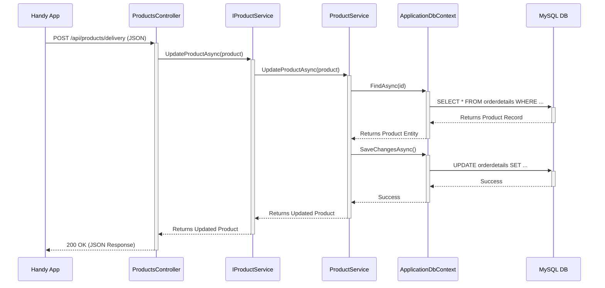

# High-Level System Overview

This document provides a high-level overview of the HandyBackend system
architecture, its key components, and how they interact.

## Core Purpose

The primary purpose of this backend is to serve as a REST API for the Handy
Android application. It receives delivery records from the handheld devices,
validates the data, and updates the central database.

## Architectural Design

The system is built using ASP.NET Core and follows a standard layered
architecture pattern. This separates concerns, making the application more
maintainable, testable, and scalable.

The main layers are:

1. **Controller Layer:** The entry point for all HTTP requests.
2. **Service Layer:** Contains the core business logic.
3. **Data Access Layer:** Responsible for all database interactions, managed by
   Entity Framework Core.

---

## Key Components and their Roles

### 1. `ProductsController.cs`

- **Role:** API Endpoint / Entry Point
- **Description:** This class is responsible for handling incoming HTTP
requests from the client. It defines the API routes (e.g., `POST
/api/products/delivery`). Its primary job is to receive data (as DTOs),
validate the request, call the appropriate service method, and return an HTTP
response (like `200 OK` or `404 Not Found`). It uses Dependency Injection to
get an instance of `IProductService`.

### 2. `IProductService.cs` (Interface)

- **Role:** Service Contract
- **Description:** This interface defines the contract for the business logic.
It specifies *what* operations can be done (e.g., `UpdateProductAsync`,
`GetProductByOrderDetailIdAsync`), but not *how* they are done. Using an
interface allows the controller to be decoupled from the specific
implementation, which is great for testing.

### 3. `ProductService.cs`

- **Role:** Business Logic Implementation
- **Description:** This is the concrete implementation of the `IProductService`
interface. It contains the core business logic of the application. It
coordinates data access operations by using the `ApplicationDbContext` to fetch
and save entities.

### 4. `ApplicationDbContext.cs`

- **Role:** Data Access / Unit of Work
- **Description:** This class is the bridge between the C# code and the
database. It inherits from Entity Framework Core's `DbContext`. It contains
`DbSet<Product>` which represents the `orderdetails` table（商品情報テーブル）. The
`OnModelCreating` method is used to explicitly map the `Product` class
properties to their corresponding database column names (e.g., `Amount` ->
`SalesQuantity`).

### 5. `Product.cs` (Entity Model)

- **Role:** Data Model
- **Description:** This is a simple C# class (a POCO) that represents a single
record in the `orderdetails` table（商品情報テーブル）. EF Core uses this model to read data from
and write data to the database.

### 6. DTOs (`DeliveryRecordDto.cs`, etc.)

- **Role:** Data Transfer Objects
- **Description:** These classes define the shape of the data that is sent to
and from the API. For example, `DeliveryRecordDto` exactly matches the
structure of the JSON payload sent by the Android client. This prevents the
internal database models (`Product.cs`) from being directly exposed to the
client.

---

## Request Flow Diagram

The following diagram illustrates the flow of a typical `ProcessDelivery`
request through the system.

